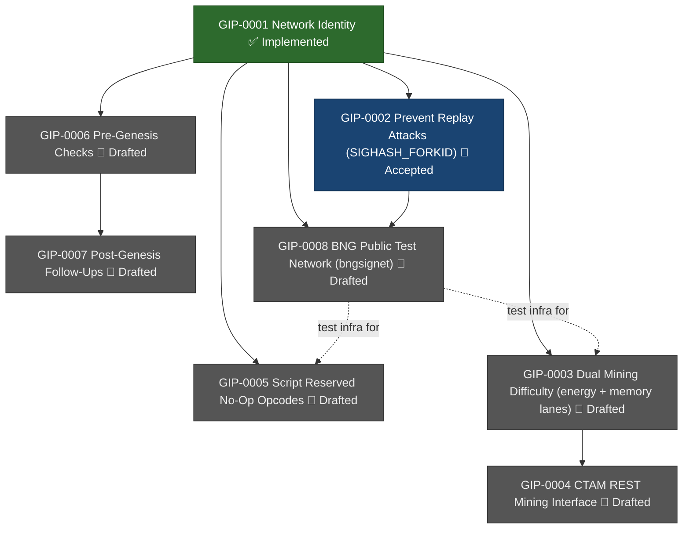

# BNG Roadmap

This document summarises the current GIP landscape and their relationships.
For individual proposals see [`doc/bng/gip/`](gip/).

## GIP Status

| GIP | Title | Status |
|-----|-------|--------|
| [GIP-0001](gip/implemented/GIP-0001-network-identity/README.md) | Network Identity | ✅ Implemented |
| [GIP-0002](gip/accepted/GIP-0002-prevent-replay-attacks/README.md) | Prevent Replay Attacks (SIGHASH_FORKID) | 🔵 Accepted |
| [GIP-0003](gip/drafted/GIP-0003-dual-mining-difficulty/README.md) | Dual Mining Difficulty (energy + memory lanes) | 📝 Drafted |
| [GIP-0004](gip/drafted/GIP-0004-ctam-rest-mining-interface/README.md) | CTAM REST Mining Interface | 📝 Drafted |
| [GIP-0005](gip/drafted/GIP-0005-script-reserved-noops/README.md) | Script Reserved No-Op Opcodes | 📝 Drafted |
| [GIP-0006](gip/drafted/GIP-0006-pre-genesis-checks/README.md) | Pre-Genesis Checks | 📝 Drafted |
| [GIP-0007](gip/drafted/GIP-0007-post-genesis-followups/TODO) | Post-Genesis Follow-Ups | 📝 Drafted |
| [GIP-0008](gip/drafted/GIP-0008-bng-public-test-network/README.md) | BNG Public Test Network (bngsignet) | 📝 Drafted |

## Dependency & Phase Diagram

## Phases

### Phase 1 — Foundation (complete)
- **GIP-0001** established BNG network identity: magic bytes, ports, Base58/Bech32 prefixes, BIP32 versions, genesis.
- **GIP-0002** adds replay protection via `SIGHASH_FORKID` so BNG transactions cannot be replayed on Bitcoin.

### Phase 2 — Mining Innovation
- **GIP-0003** introduces a dual-difficulty mining schedule alternating between an energy (SHA256d) lane on odd weeks and a memory-hard CTAM lane on even weeks.  
  Requires an extended block header (`nBits` + `nMemBits`) and independent retarget logic per lane.
- **GIP-0004** decouples CTAM proof generation from the node via a REST interface, enabling the node to talk to a local CTAM webservice (initially via Docker Compose).

### Phase 3 — Script Evolution (parallel with Phase 2)
- **GIP-0005** reserves a family of `OP_BNGNOPx` opcodes as upgrade space, with no-op semantics until a future GIP assigns meaning.

### Phase 4 — Pre-Genesis Checks
- **GIP-0006** captures the remaining pre-genesis checks before BNG mainnet launch, currently focused on setting the final genesis timestamp and replacing placeholder DNS seeds with production-operated ones.

### Phase 5 — Post-Genesis Follow-Ups
- **GIP-0007** tracks the first post-genesis follow-ups after BNG mainnet has matured enough to choose a stable checkpoint for `nMinimumChainWork` and `defaultAssumeValid`.

### Phase 6 — Test Infrastructure
- **GIP-0008** introduces a BNG-owned public coordinated test network (`bngsignet`) using BIP325 signet-like block signing.  
  Unblocks reliable public integration testing for all subsequent work.

## Open Questions Blocking Progression

| GIP | Blocker |
|-----|---------|
| GIP-0003 | CTAM proof serialization, memory-lane work normalization formula |
| GIP-0004 | Which CTAM API endpoints can be reused; final wire format |
| GIP-0005 | Final opcode byte assignments (collision audit required) |
| GIP-0006 | Final mainnet launch timestamp; confirmed production DNS seed operators |
| GIP-0007 | Which block height/hash should become the first stable `nMinimumChainWork` / `defaultAssumeValid` checkpoint |
| GIP-0008 | Final chain name (`bngsignet`?), HRP, signet challenge key operations |

